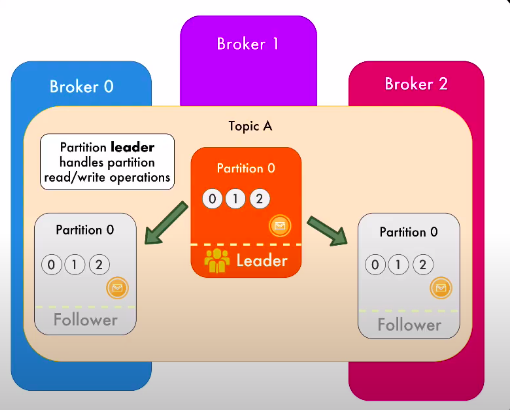
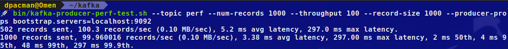
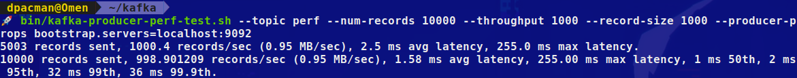
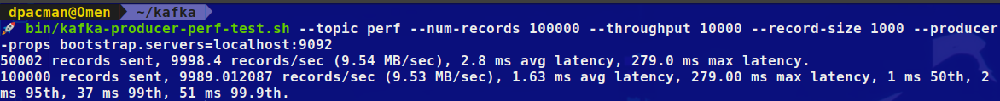
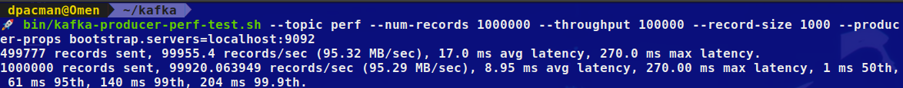

# Kafka

## Installation

- Go to <https://kafka.apache.org/downloads> and download the **binary**

- Next run `mkdir kafka && cd kafka`

- Enter the command: `tar -xvzf ~/Downloads/kafka.tgz --strip 1`

## Commands for Running Kafka Server

- To start the kafka server (broker): `bin/kafka-server-start.sh config/server.properties`

**NOTE**: The above command will **fail as kafka needs zookeeper** to run too.

- Start zookeeper server using: `bin/zookeeper-server-start.sh config/zookeeper.properties` and **then start the kafka server**.

- The Zookeeper Server runs on **localhost:2181** and Kafka Server (broker) runs on **localhost:9092**

## Creating and Exploring Kafka Topic

- **Create** a Topic: `bin/kafka-topics.sh --create --bootstrap-server localhost:9092 --topic TOPIC_NAME`

You can check the log of creation in the `/kafka/logs/server.log` file

**What happens after creation of the topic?** If you take a look inside `ls /tmp/kafka-logs` there will be a **cities-0** log folder, inside these there are different log files which will be **initially empty** as we have not sent any messages to this topic. As soon as we start sending messages, **kafka will store new messages inside these files**.

**Why does the folder have weird name like "cities-0"?** Inside the `/config/server.properties` you will notice that the default **number of partitions is 1**. Inside of every topic, **messages can be spread among several partitions** and every partition will have its own folder **cities-0, cities-1**

- **List** Topics in a Server: `bin/kafka-topics.sh --list --bootstrap-server localhost:9092` or `bin/kafka-topics.sh --list --zookeeper localhost:2181`

- **Read** details of a Topic: `bin/kafka-topics.sh --describe --zookeeper localhost:2181 --topic TOPIC_NAME`

## Producing & Consuming in Kafka

Producers **send messages** to the Kafka cluster. Consumers **receive messages** from the Kafka cluster.

We can use any producer to send messages to the Topic. But let us use the producer that is shipped with the Kafka installation located in `/bin/kafka-console-producer.sh`

- **Produce** to a topic: `bin/kafka-console-producer.sh --bootstrap-server localhost:9092 --topic TOPIC_NAME`

Once the above command is run, it will take you to the **console**, where you can enter the messages.

- **Consume** a topic/s: `bin/kafka-console-consumer.sh --bootstrap-server localhost:9092 --WHITE_LIST/TOPIC TOPIC_NAME`

**NOTE**: WHITE_LIST is for connecting to a set of topics and read from **multiple topics** using wildcard syntax. TOPIC is for reading message from a **single topic**.

The above command will open like console interface and any new messages produced will show up in the consumer.

If you had noticed, only the **latest messages seem to be consumed by the** consumer. How do we **consume all the messages from the beginning**? Use the **--from-beginning** flag

- **Consume** a topic/s: `in/kafka-console-consumer.sh --bootstrap-server localhost:9092 --topic TOPIC_NAME --from-beginning`

**IMPORTANT**: Kafka cluster **stores messages** even if they were **already consumed by one of the consumers**. Therefore, the **same messages** may be **read multiple times** by **multiple consumers**.

Producers and Consumers may appear and disappear. But Kafka doesn't care about that. It's **job is to store messages and receive or send them on demand**.

#### **Where has Kafka broker stored those messages?**

If you open the `/config/server.properties` file you will notice the `log.dirs=/tmp/kafka-logs`. Inside this folder `00000000.log` file is where the messages are stored.

**NOTE**: Kafka **doesn't store all messages forever** and after a specific amount of time (or when size of log exceeds configured max size) messages are deleted.
The **default** log retention period is **7 days (168 hours)**

**What are offsets in a topic?** Every **message** inside a topic has a **unique number** called offset. **First message in each topic has an offset 0**. Consumers start reading messages starting from specific offset.

## Topic with Multiple Partitions

Delete the `/tmp/kafka-logs` folder and restart the Zookeeper and Kafka servers.

- **Create** a topic with **3 partitions** of name **animals**: `bin/kafka-topics.sh --bootstrap-server localhost:9092 --create --replication-factor 1 --partitions 3 --topic animals`

Now inside the `/tmp/kafka-logs/` folder you will find **3 animals folder**, one for each partition.

- Start the **producer**: `bin/kafka-console-producer.sh --bootstrap-server localhost:9092 --topic animals` an produce a few messages

- Start the **consumer**: `bin/kafka-console-consumer.sh --bootstrap-server localhost:9092 --topic animals --from-beginning`

**IMPORTANT**: If you notice, the **messages in the consumer are in a different order**. This is because we have created a **topic with several partitions** and every consumers that connects to the topic will have to read from multiple partitions, it won't read in any round-robin fashion. It **can read in a different order**. A thing to keep in mind is that **consumers may not always read messages in the same order that they were produced**.

- **Consume** from a **specific partition**: `bin/kafka-console-consumer.sh --bootstrap-server localhost:9092 --partition 1 --topic animals --from-beginning`

- **Consume** from **specific offset** from **specific partition**: `bin/kafka-console-consumer.sh --bootstrap-server localhost:9092 --partition 2 --topic animals --offset 0`

- **Consume** from **specific offset** from **all partitions**: `bin/kafka-console-consumer.sh --bootstrap-server localhost:9092 --topic animals --offset 1` - This will throw an error as **partition is required while specifying offset**. Remember, it is **not possible to read from a specific offset across the entire topic partitions**.
  
- Topic **details**: `bin/kafka-topics.sh --bootstrap-server localhost:9092 --describe --topic animals`

## Cluster with Multiple Brokers

Now that we understand the basics, let us now **run 3 different brokers** on the same machine. Start by deleting the `/tmp/kafka-logs` and `/tmp/zookeeper` folders.

**NOTE**: To run 3 different broker, you would need to create 3 different `server.properties` file with **unique port**, **broker ID** and **log directory**.

- In the `kafka/config` folder, create `server0.properties, server1.properties and server2.properties`

- Modify the **broker. id**, uncomment the **listeners://:909X** and change the **log.dirs=/tmp/kafka-logs-x**

- Start **Zookeeper**: `bin/zookeeper-server-start.sh config/zookeeper.properties`

- Start **3 different brokers**:
`bin/kafka-server-start.sh config/server0.properties`
`bin/kafka-server-start.sh config/server1.properties`
`bin/kafka-server-start.sh config/server2.properties`

How do we verify which brokers are active in the cluster? We can use **Zookeeper to get cluster info (active brokers)**.

- Get info from Zookeeper about **active broker IDs**: `bin/zookeeper-shell.sh localhost:2181 ls /brokers/ids`

- Get info from Zookeeper about **specific broker by ID**: `bin/zookeeper-shell.sh localhost:2181 get /brokers/ids/ID_NUMBER`

Let us now create a **topic** with **replication factor 1** and **partition count 5**.

- **Create topic**: `bin/kafka-topics.sh --bootstrap-server localhost:9092,localhost:9093,localhost:9094 --create --replication-factor 1 --partitions 5 --topic cars`

The **5 partitions will be randomly created on each of the brokers**. To understand better, explore the `/tmp/kafka-logs-x` folder.

Let us now start **producing** to the topic

- **Produce** to topic: `bin/kafka-console-producer.sh --broker-list localhost:9092,localhost:9093,localhost:9094 --topic cars`

- **Consume** the topic: `bin/kafka-console-consumer.sh --bootstrap-server localhost:9092,localhost:9093,localhost:9094 --topic cars`

- **List** topics: `bin/kafka-topics.sh --bootstrap-server localhost:9092,localhost:9093,localhost:9094 --list`

- **Topic details**: `bin/kafka-topics.sh --bootstrap-server localhost:9092,localhost:9093,localhost:9094 --describe --topic cars`

- **Consume from beginning**: `bin/kafka-console-consumer.sh --bootstrap-server localhost:9092,localhost:9093,localhost:9094 --topic cars --from-beginning`

Now let us **simulate a broker failure** by shutting down one of the brokers. If you **restart the consumer** now, you will notice a warning message saying that **all the messages could not be read as the partitions in the broker was not available**.

If you list the **Topic details**, you will notice that 2 leaders are none. Then, if you restart the broker, everything will be back to normal. To avoid this, we should use a **replication factor of more than 1**.

## Cluster with Multiple Brokers and Topic with Replication

We will use the same example as above, but this time with **replication**. First, delete the `/tmp/kafka-logs-x` and `/tmp/zookeeper` folders.

- Start **Zookeeper**: `bin/zookeeper-server-start.sh config/zookeeper.properties`

- Start **3 different brokers**:
`bin/kafka-server-start.sh config/server0.properties`
`bin/kafka-server-start.sh config/server1.properties`
`bin/kafka-server-start.sh config/server2.properties`

- Get info from Zookeeper about **active broker IDs**: `bin/zookeeper-shell.sh localhost:2181 ls /brokers/ids`

- **Create topic with replication 3**: `bin/kafka-topics.sh --bootstrap-server localhost:9092,localhost:9093,localhost:9094 --create --replication-factor 3 --partitions 7 --topic months`

**IMPORTANT**: Even in production env it is **not necessary** to go with a **replication factor beyond 3**. Total quantity of partitions in the topic will be = (**partition** x **replication**) = (7 x 3) = **21**. Therefore, atleast **7 partitions will be created in each broker**.

**NOTE**: If there are replicas then **one of the brokers is the leader for a specific partition and all the remaining brokers are followers**. They simply accept write request from the leader and they don't share producers and consumers for particular partitions where they are leaders.

- **List** topics: `bin/kafka-topics.sh --bootstrap-server localhost:9092,localhost:9093,localhost:9094 --list`

Once you list topics, **__consumer_offsets** topic is missing here, why? **Because we haven't consumed any messages at this point**.

- **Topic details**: `bin/kafka-topics.sh --bootstrap-server localhost:9092,localhost:9093,localhost:9094 --describe --topic months`

From the above topic details command, you can see the **leader broker for each partition**.

Let us now start **producing** to the topic

- **Produce** to topic: `bin/kafka-console-producer.sh --broker-list localhost:9092,localhost:9093,localhost:9094 --topic months`

- **Consume** the topic: `bin/kafka-console-consumer.sh --bootstrap-server localhost:9092,localhost:9093,localhost:9094 --topic months --from-beginning`

- **Consume** from a **specific partition**: `bin/kafka-console-consumer.sh --bootstrap-server localhost:9092,localhost:9093,localhost:9094 --partition 3 --topic months --from-beginning`

- **Consume** from **specific offset** from **specific partition**: `bin/kafka-console-consumer.sh --bootstrap-server localhost:9092,localhost:9093,localhost:9094 --partition 3 --topic months --offset 1`

**NOTE**: In the `/tmp/kafka-logs-x/` folders, observe how the messages are store. As every broker has all the 7 partitions, the **same messages will be present across the brokers in a particular partition** due to the replication factor = number of brokers.

Now let us **simulate a broker failure** by shutting down  the **broker with ID 1** and see how the consumers and producers react.

**IMPORTANT**: If you check the **topic details**, you will notice that **a new leader has been elected in place of broker with ID 1**.
Also notice the **In Sync Replicas (Isr)**, it is one broker short.

- Now **re-run the consumer** and **all the messages will still show up**.

What would happen if **another broker is brought down**? Let's bring down broker with ID 0 and see what happens.

If you produce messages after bringing it down, you will notice that the **consumer still consumes the messages**. Check the **topic details**, there will be another leader re-election with only one Isr left.

#### What would happen if you revive back both the dead brokers?

After a minute **there will be a re-election of a new leader**, and the **Isr has changed**.

## Kafka Consumer Groups

- Start **Zookeeper**: `bin/zookeeper-server-start.sh config/zookeeper.properties`

- Start **Kafka brokers**: `bin/kafka-server-start.sh config/server.properties`

- **Create a topic**: `bin/kafka-topics.sh --bootstrap-server localhost:9092 --create --replication-factor 1 --partitions 5 --topic numbers`

- **List** topics: `bin/kafka-topics.sh --bootstrap-server localhost:9092 --list`

- **Produce** to topic: `bin/kafka-console-producer.sh --broker-list localhost:9092 --topic numbers`

- **Consume** the topic: `bin/kafka-console-consumer.sh --bootstrap-server localhost:9092 --topic numbers`

- **List Consumer Groups**: `bin/kafka-consumer-groups.sh --bootstrap-server localhost:9092 --list`

Now create another consumer, then **list the consumer groups**, you will notice that there will be **2 consumer groups**. The purpose of creating consumer groups in kafka is to reduce the load on the consumers.

#### Why do we need consumer groups?

Let's imagine that there is some topic with multiple producers who send messages to it at very high rates (1000s msgs/sec). A single consumer may not be able to consume all the produced messages at the same high rates. That's why consumers may be organized into **consumer groups to share consumption of messages**

- **Consumer group details**: `bin/kafka-consumer-groups.sh --bootstrap-server localhost:9092 --group CONSUMER_GRP_NUM --describe`

**NOTE:** For every consumer, a **consumer group will be created automatically**.

- **Consumer with specific consumer group**: `bin/kafka-console-consumer.sh --bootstrap-server localhost:9092 --topic numbers --group numbers-group --from-beginning`

After creating this consumer with a custom group. List the details of this group

- **Specific consumer group details**: `bin/kafka-consumer-groups.sh --bootstrap-server localhost:9092 --group numbers-group --describe`

Here, you will notice the number of partitions in that consumer and also the **number of messages stored** in each partition denoted by **current offset**.

Now, start another consumer and read from a specific partition

- **Consume from a specific partition**: `bin/kafka-console-consumer.sh --bootstrap-server localhost:9092 --partition 3 --topic numbers --from-beginning`

**NOTE:** If you notice the details of the consumer group, you will see that all the partitions have the **same ID**, this is because we have just **one consumer in the consumer group**.

Let us now try starting **another consumer in the same consumer group**.

- **Second Consumer in the same consumer group**: `bin/kafka-console-consumer.sh --bootstrap-server localhost:9092 --topic numbers --group numbers-group --from-beginning`

**IMPORTANT:** If you notice the output of the **second consumer in the same consumer group**, **there aren't any messages consumed** even after adding the --from-beginning flag. Now, if you see the **details of the consumer group**, the consumer ID would be different, i.e the **partitions would be split equally between both the consumers**.

**REMEMBER:** Each message is consumed only once by either of the consumers. Once a consumer receives a message, the **same message cannot be consumed by another consumer in the same consumer group**.

What would happen is the **number of consumers in the consumer group** is **more than the number of partitions?** The **extra consumers will remain idle** and those will start consuming if any of the active consumer stops.

## Kafka Performance Testing

In this section, let us start a Kafka cluster with multiple brokers. Test the performance of the producer and consumer.

There is a built in utility to test the performance. With this utility, we will be able to produce multiple messages to out cluster at specific rates. We will be able to observe how fast the cluster would be able to write those messages and consumers would read the same.

- Start **Zookeeper**: `bin/zookeeper-server-start.sh config/zookeeper.properties`

- Start **3 different brokers**:
`bin/kafka-server-start.sh config/server0.properties`
`bin/kafka-server-start.sh config/server1.properties`
`bin/kafka-server-start.sh config/server2.properties`

- **Create topic with replication-3 partitions-100**: `bin/kafka-topics.sh --bootstrap-server localhost:9092,localhost:9093,localhost:9094 --create --replication-factor 3 --partitions 100 --topic perf`

- **Consume** the topic: `bin/kafka-console-consumer.sh --bootstrap-server localhost:9092,localhost:9093,localhost:9094 --topic perf`

Now, let's try to test our cluster by producing multiple messages with the built-in utility.

- **Producer Performance Test 1**: `bin/kafka-producer-perf-test.sh --topic perf --num-records 1000 --throughput 100 --record-size 1000 --producer-props bootstrap.servers=localhost:9092`

**--num-records**: How many messages in total will be produced.
**--throughput**: How many messages producer per second.
**--record-size**: Size of every message in bytes.
**--producer-props**: Requires a list of key-value pairs, mandatory key is bootstrap.servers that should point to one of the servers in the kafka cluster.

- **Producer Performance Test 2**: `bin/kafka-producer-perf-test.sh --topic perf --num-records 10000 --throughput 1000 --record-size 1000 --producer-props bootstrap.servers=localhost:9092`

- **Producer Performance Test 3**: `bin/kafka-producer-perf-test.sh --topic perf --num-records 100000 --throughput 10000 --record-size 1000 --producer-props bootstrap.servers=localhost:9092`

- **Producer Performance Test 4**: `bin/kafka-producer-perf-test.sh --topic perf --num-records 1000000 --throughput 100000 --record-size 1000 --producer-props bootstrap.servers=localhost:9092`

Let us now test the performance of consumer.

- **Consumer Performance Test 1**: `bin/kafka-consumer-perf-test.sh --topic perf --broker-list localhost:9092 --messages 10000`

- **Consumer Performance Test 2**: `bin/kafka-consumer-perf-test.sh --topic perf --broker-list localhost:9092 --messages 100000`

- **Consumer Performance Test 3**: `bin/kafka-consumer-perf-test.sh --topic perf --broker-list localhost:9092 --messages 1000000`
